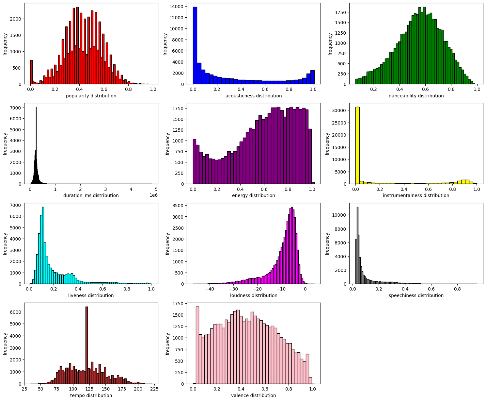

### Capstone project: Spotify dataset classification. Machine Learning, Spring 2024

### Yan Konichshev; yk2602

---

Structure of the project and the files I am going to be referring to throughout the report:

```bash
.
├── capstone_data_cleaning.ipynb (1)
├── capstone_dimension_reduction.ipynb (2)
├── classifications
│  ├── capstone_classification_lda_ds.ipynb (3)
│  └── reducedDataSets
│     ├── lda_training.csv (4)
│     ├── lda_x_testing.csv (5)
│     └── lda_y_testing.csv (6)
├── dataSet
│  └── musicData.csv (7)
├── LICENSE
├── poetry.lock
├── processed_dataset.csv (8)
├── project_spec_sheet.pdf
├── pyproject.toml
└── README.md
```

| Number | File Name                                              | Description                                                |
| ------ | ------------------------------------------------------ | ---------------------------------------------------------- |
| 1      | `capstone_data_cleaning.ipynb`                         | code for cleaning the dataset.                             |
| 2      | `capstone_dimension_reduction.ipynb`                   | code for dimensionality reduction.                         |
| 3      | `classifications/capstone_classification_lda_ds.ipynb` | code for classification using the LDA dataset.             |
| 4      | `classifications/reducedDataSets/lda_training.csv`     | reduced dataset containing LDA components.                 |
| 5      | `classifications/reducedDataSets/lda_x_testing.csv`    | reduced dataset using the LDA method.                      |
| 6      | `classifications/reducedDataSets/lda_y_testing.csv`    | reduced dataset using the PCA method.                      |
| 7      | `dataSet/musicData.csv`                                | this is the original dataset.                              |
| 8      | `processed_dataset.csv`                                | this is the dataset I got after cleaning the original one. |

---

Beggining of the report.

#### A: how I build my model and ?

I build various models, including Perceptron, Deep Neural Network with 2 layers, Multivariate Logistic Regression, and a Decision Tree Classifier. I build all of them after I performed a thorough data cleaning and dimension reduction, which allowed me to extract the most important features from the original dataset, and further operate on them to achieve the best results in this song classification task.

#### B: how I handled challenges imposed by the dataset?

I have to say that the original dataset was a mess to work with, as it contained a number of missing values, uninterpretable signs, such as question marks `?` for the fields which were supposed to be NaNs, `-1` values for the duration of some songs, and etc. I had to examine all those minor details and handle them accordingly. All the detail steps could be found in the `capstone_data_cleaning.ipynb` file. After the data cleaning, I performed a dimensionality reduction using PCA and LDA methods, which allowed me to extract the most important features from the original dataset. I used PCA to see what the data loadings The reduced datasets could be found in the `classifications/reducedDataSets` directory.

#### C: visualizations of ROC curves, clusterings

#### D: the most important factor underlying my classification success

<figure>
  
  <figcaption>Fig. 1.1 - Confusion marix for perceptron</figcaption>
</figure>

---

End of the report.
