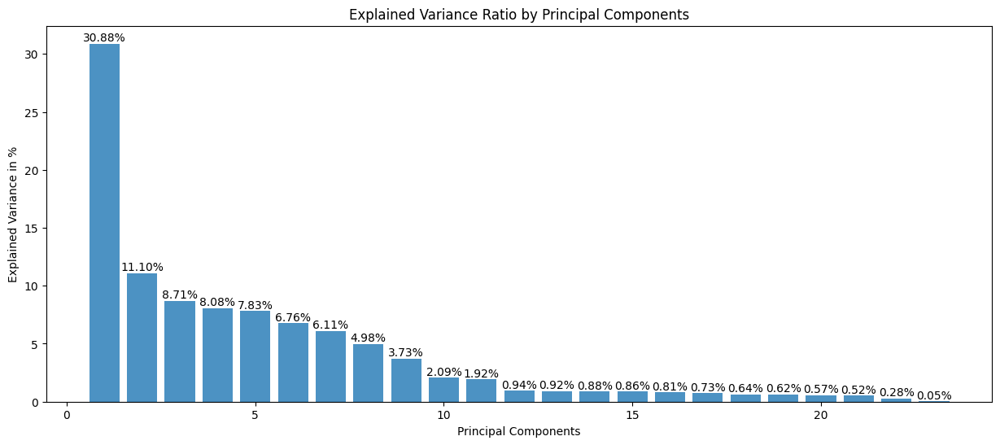
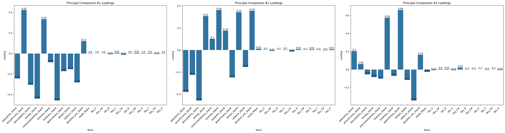

### Capstone project: Spotify dataset classification. Machine Learning, Spring 2024

### Yan Konichshev; yk2602

---

Structure of the project and the files I am going to be referring to throughout the report:

```bash
.
├── capstone_data_cleaning.ipynb (1)
├── capstone_dimension_reduction.ipynb (2)
├── classifications
│  ├── capstone_classification_lda_ds.ipynb (3)
│  └── reducedDataSets
│     ├── lda_training.csv (4)
│     ├── lda_x_testing.csv (5)
│     └── lda_y_testing.csv (6)
├── dataSet
│  └── musicData.csv (7)
├── LICENSE
├── poetry.lock
├── processed_dataset.csv (8)
├── project_spec_sheet.pdf
├── pyproject.toml
└── README.md
```

| Number | File Name                                              | Description                                                |
| ------ | ------------------------------------------------------ | ---------------------------------------------------------- |
| 1      | `capstone_data_cleaning.ipynb`                         | code for cleaning the dataset.                             |
| 2      | `capstone_dimension_reduction.ipynb`                   | code for dimensionality reduction.                         |
| 3      | `classifications/capstone_classification_lda_ds.ipynb` | code for classification using the LDA dataset.             |
| 4      | `classifications/reducedDataSets/lda_training.csv`     | reduced dataset containing LDA components.                 |
| 5      | `classifications/reducedDataSets/lda_x_testing.csv`    | reduced dataset using the LDA method.                      |
| 6      | `classifications/reducedDataSets/lda_y_testing.csv`    | reduced dataset using the PCA method.                      |
| 7      | `dataSet/musicData.csv`                                | this is the original dataset.                              |
| 8      | `processed_dataset.csv`                                | this is the dataset I got after cleaning the original one. |

---

Beggining of the report.

#### A: how I build my model and how I made my design choices?

I built various models, including Perceptron, Deep Neural Network with 3 layers, Multivariate Logistic Regression, and Decision Tree Classifiers, including Random Forests and others. I build all of them after I performed a thorough data cleaning and dimension reduction, which allowed me to perform feature extraction from the original dataset, and further operate on them to achieve the best results in this song classification task. I used the LDA and PCA methods to reduce the dimensionality of the dataset, and then I used the reduced dataset which I got from LDA to train and test the models. The results of the classification could be found in the `classifications` directory. Before proceeding onto working with the LDA data, I made sure I perform a clustering task, which could be found in the `capstone_dimension_reduction.ipynb` file. I used the KMeans clustering algorithm to cluster the data, however I did not find any useful information from the clustering, as the data was not clustered in a way that could be useful for the classification task. My most optimal number of clusters was 3 (based on the silhouette scores and distortions), when we clearly know that there are 10 music genres I need to find, thus I made a decision not to use it. Additionally, I have to mention that lower dimensional data, which I got from LDA, was not separable, which might be one of the key reasons kMeans didn't do well. This, however prompted me to use neural network model and random forests, as they might be the best approaches to handle the non-linear data. For each model, I have produced an ROC curve plot, which are all contained in the classisfications directory. The best ROC score I got was from the Random Forest classifier with an AUC of 0.8985 across all the classes. The worst performing model was the neural network, which had an AUC of 0.5 for the Hip-Hop genre, which is a very poor result. I have been making a lot of decisions, and the trace for my decisions could be traced from the figures in this report as well as from the code in the notebooks (I tend to leave comments whenever I make a turning decision).

#### B: how I handled challenges imposed by the dataset?

I have to say that the original dataset was a mess to work with, as it contained a number of missing values, uninterpretable signs, such as question marks `?` for the fields which were supposed to be NaNs, `-1` values for the duration of some songs, and etc. I had to examine all those minor details and handle them accordingly. All the detail steps could be found in the `capstone_data_cleaning.ipynb` file. I also had to handle the categorical data, such as the key of the song, the mode of the song, and the genre of the song. I had to transform genres into numerical data to be useful for the classification task. I also had to dummy code the mode and the key of the song, as they were categorical variables. I made sure there was no data leakeage by identifying identical row entries, except for the genre, and by merging them, so that I can make sure one song corresponds to a unique genre. This is a valid approach, as that song certainly belongs to the identified genre.

#### C: visualizations of ROC curves, clusterings

<title>Image Grid</title>
<style>
    .grid-container {
      display: grid;
      grid-template-columns: repeat(auto-fill, minmax(300px, 1fr));
      grid-gap: 20px;
    }

    .grid-item {
      text-align: center;
    }

    .grid-item img {
      min-width: 100%; /* Ensures image width doesn't shrink below its original width */
      min-height: 300px; /* Sets a minimum height for the images */
      max-height: 100%; /* Allows the image to scale vertically if needed */
      object-fit: contain; /* Maintains aspect ratio while fitting the image within the specified dimensions */
    }

</style>

<div class="grid-container">
    <div class="grid-item">
    <figure>
      
      <figcaption>Fig. 1.1 - Frequency distributions of the continuos variables</figcaption>
    </figure>
    </div>
  <div class="grid-item">
  <figure>
    
    <figcaption>Fig. 1.2 - Explained variance ratios for PCA components</figcaption>
  </figure>
  </div>

  <div class="grid-item">
  <figure>
    
    <figcaption>Fig. 1.3 - Eigenvalues in the PCA analysis</figcaption>
  </figure>
  </div>

  <div class="grid-item">
  <figure>
    
    <figcaption>Fig. 1.4 - Component loadings in the PCA</figcaption>
  </figure>
  </div>

  <div class="grid-item">
  <figure>
    
    <figcaption>Fig. 1.5 - PCA in 2D</figcaption>
  </figure>
  </div>

  <div class="grid-item">
  <figure>
    
    <figcaption>Fig. 1.6 - PCA in 3D: promise to a better separation</figcaption>
  </figure>
  </div>

  <div class="grid-item">
  <figure>
    
    <figcaption>Fig. 1.7- Feature importance extracted from the LDA</figcaption>
  </figure>
  </div>

  <div class="grid-item">
  <figure>
    
    <figcaption>Fig. 1.8 - Explained variance ratio in LDA</figcaption>
  </figure>
  </div>

  <div class="grid-item">
  <figure>
    
    <figcaption>Fig. 1.9 - LDA solution in 2D</figcaption>
  </figure>
  </div>

  <div class="grid-item">
  <figure>
    
    <figcaption>Fig. 1.10 - LDA solution in 2D</figcaption>
  </figure>
  </div>

  <div class="grid-item">
  <figure>
    
    <figcaption>Fig. 1.11 - Clusters from k-Means performed on LDA components</figcaption>
  </figure>
  </div>

  <div class="grid-item">
  <figure>
    
    <figcaption>Fig. 1.12 - Silhouette Scores to identify the number of clusters</figcaption>
  </figure>
  </div>

  <div class="grid-item">
  <figure>
    
    <figcaption>Fig. 1.13 - Distortions to help with identifying the number of clusters</figcaption>
  </figure>
  </div>

  <div class="grid-item">
  <figure>
    
    <figcaption>Fig. 2.1 - Confusion Matrix for perceptron model</figcaption>
  </figure>
  </div>

  <div class="grid-item">
  <figure>
    
    <figcaption>Fig. 2.2. - Training loss for the neural network</figcaption>
  </figure>
  </div>

  <div class="grid-item">
  <figure>
    
    <figcaption>Fig. 2.3 - AUC score improvement for the neural network</figcaption>
  </figure>
  </div>

  <div class="grid-item">
  <figure>
    
    <figcaption>Fig. 2.4 - ROC curve for the neural network: generally a good job, but horrible perfromance for Hip-Hop classification</figcaption>
  </figure>
  </div>

  <div class="grid-item">
  <figure>
    
    <figcaption>Fig. 2.5 - Decision tree classifier using bagging: better performance than neural networks</figcaption>
  </figure>
  </div>

  <div class="grid-item">
  <figure>
    
    <figcaption>Fig. 2.6 Random Forest classifier: the best performing model</figcaption>
  </figure>
  </div>

  <div class="grid-item">
  <figure>
    
    <figcaption>Fig. 2.7 - AdaBoost Classifier</figcaption>
  </figure>
  </div>

  <div class="grid-item">
  <figure>
    
    <figcaption>Fig. 2.8 - Multivariate Logistic regression: surprising performance for a simple model</figcaption>
  </figure>
  </div>

  <div class="grid-item">
  <figure>
    
    <figcaption>Fig. 2.9 - Decision tree with depth 2</figcaption>
  </figure>
  </div>

</div>

#### D: the most important factor underlying my classification success

I think the most important factor for the success of my classifications was a thorough data cleaning and data preparation process. I cannot overestimate the role of the dimension reductions, which I performed. Through feature extraction, I was able to reduce my dataset from more than 20 features into 3 LDA components, which explained the most variance, which in its turn reduced the model complexity significantly. I also think that the choice of the models was crucial, as I had to use the models which could handle the non-linear data, which I got from the LDA. I think that the the random forests were the best choices for this task, as they are able to handle the non-linear data, and they are able to classify the data into multiple classes, which is the case for this task.

---

End of the report.
